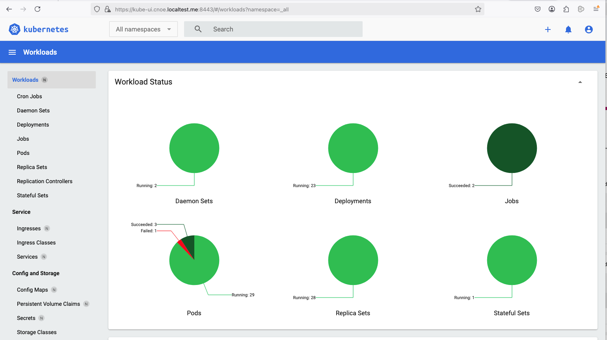

## Kiubernetes dashboard package

The following package allows to install the [kubernetes dashboard](https://github.com/kubernetes/dashboard/) that you can access using the url: `https://kube-ui.cnoe.localtest.me:8443`



**Note**: To get the token password to access the UI, execute the following command post installation
```shell
kubectl -n kubernetes-dashboard create token admin-user
```
